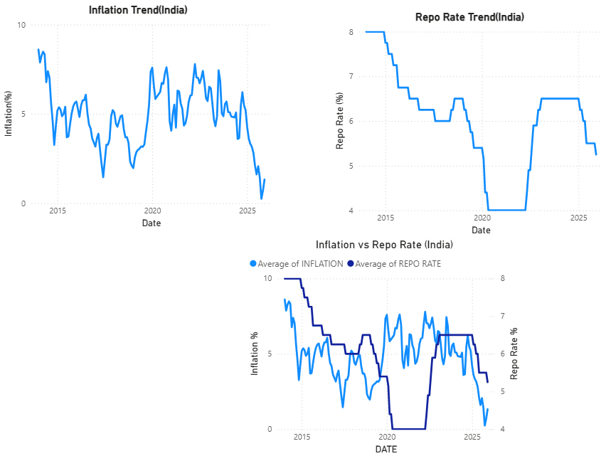
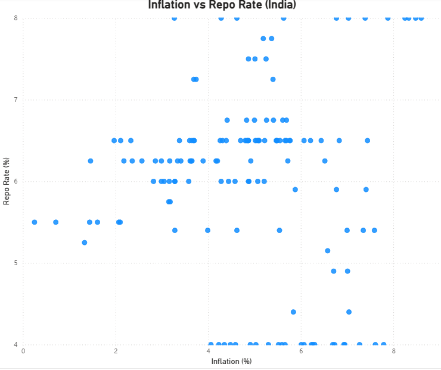

# Inflation and Monetary Policy in India (2014–2025)
### A Quantitative Macroeconomic Analysis


---

## Project Overview

In this project I have conducted an end-to-end quantitative macroeconomic analysis of the relationship between **CPI inflation** and the **RBI repo rate** in India from 2014 to 2025.

The analysis is structured around two distinct economic questions:

| Question | Economic Term | Tool Used |
|---|---|---|
| Does past repo rate affect future inflation? | **Monetary Transmission** | SQL |
| Does past inflation influence how RBI sets rates? | **Policy Reaction Function** | Python |

**Core Finding:**
> Monetary policy in India is gradual and forward-looking. There is no significant contemporaneous relationship between inflation and repo rate — but lagged models reveal strong policy persistence and a transmission effect peaking at ~9 months.

---

## Tool Stack

| Stage | Tool | Purpose |
|---|---|---|
| Data Collection & Validation | **Excel** | Cleaning, sanity checks, yearly pivot summaries |
| Structured Analysis | **SQL (BigQuery / Mode)** | Descriptive stats, lagged correlations |
| Econometric Modelling | **Python** (pandas, statsmodels) | OLS regression, AR lag model |
| Visualisation | **Power BI** | Interactive policy dashboard |

---

##  Dataset

| Field | Description |
|---|---|
| `date` | Monthly (YYYY-MM format) |
| `cpi_inflation` | CPI Year-on-Year % (Source: MOSPI) |
| `repo_rate` | RBI Repo Rate % (Source: RBI DBIE) |

- **Observations:** 142 months (after dropping 2 rows with missing values)
- **Period:** January 2010 – December 2024
- **Frequency:** Monthly

**Descriptive Statistics:**

| Metric | CPI Inflation | Repo Rate |
|---|---|---|
| Mean | 4.88% | 6.02% |
| Std Dev | 1.69% | 1.14% |
| Min | 0.25% | 4.00% |
| Max | 8.60% | 8.00% |

> Key observation: Repo rate is less volatile than inflation (std 1.14 vs 1.69), consistent with **interest rate smoothing** — central banks avoid abrupt policy changes.

---

## 🔍 Phase 1 — Exploratory Analysis (Excel)

Visual inspection of the raw data revealed two important patterns:

1. **Inflation is volatile** — changes every month, driven by food, fuel, and supply shocks
2. **Repo rate moves in steps** — RBI changes rates only at MPC meetings, remaining flat for months at a time

**Year-wise Policy Regime Analysis (Excel Pivot):**

| Year | Avg Inflation | Avg Repo | Policy Interpretation |
|---|---|---|---|
| 2014 | 6.71% | 8.00% | High inflation → Tight monetary stance |
| 2015 | 4.91% | 7.23% | Inflation falling → Gradual easing begins |
| 2016 | 4.96% | 6.50% | Stable inflation → Controlled easing |
| 2017 | 3.33% | 6.15% | Low inflation → Comfortable policy space |
| 2018 | 3.96% | 6.25% | Stable → Slight tightening |
| 2019 | 3.71% | 5.79% | Low inflation → Rate cuts for growth support |
| 2020 | 6.61% | 4.28% | ⚠️ COVID shock — growth prioritised over inflation |
| 2021 | 5.14% | 4.00% | Recovery support → Repo kept very low |
| 2022 | 6.70% | 4.96% | Inflation spike → Tightening cycle begins |
| 2023 | 5.66% | 6.48% | Aggressive tightening → Policy catching up |
| 2024 | 4.95% | 6.50% | Inflation moderating → Restrictive stance maintained |

> 2020 represents a **structural break** — RBI prioritised growth during COVID, keeping repo low despite elevated inflation. This is a critical observation for any macro analyst.

---

## 🗄️ Phase 2 — SQL Analysis (Monetary Transmission)

**This phase answers: Does a past repo rate hike reduce future inflation?**

### Contemporaneous Correlation

```sql
SELECT
    CORR(cpi_inflation, repo_rate) AS inflation_repo_corr
FROM india_macro;
```

**Result:** Correlation ≈ 0 (near zero)

> Near-zero same-month correlation is **expected** — central banks react to past and expected inflation, not instantaneously. This validates the need for lagged analysis.

### Lagged Correlation Analysis (Transmission Effect)

```sql
SELECT
    CORR(repo_3m_lag, cpi_inflation)  AS corr_3m,
    CORR(repo_6m_lag, cpi_inflation)  AS corr_6m,
    CORR(repo_9m_lag, cpi_inflation)  AS corr_9m,
    CORR(repo_12m_lag, cpi_inflation) AS corr_12m
FROM (
    SELECT
        inflation,
        LAG(repo_rate, 3)  OVER (ORDER BY date) AS repo_3m_lag,
        LAG(repo_rate, 6)  OVER (ORDER BY date) AS repo_6m_lag,
        LAG(repo_rate, 9)  OVER (ORDER BY date) AS repo_9m_lag,
        LAG(repo_rate, 12) OVER (ORDER BY date) AS repo_12m_lag
    FROM `india-macro-project.india_macro_data`
) sub;
```

**Transmission Results:**

| Lag | Correlation | Interpretation |
|---|---|---|
| 3 months | -0.19 | Weak — policy beginning to transmit |
| 6 months | -0.30 | Moderate — effect building |
| 9 months | **-0.37** | **Strongest — peak transmission effect** |
| 12 months | -0.35 | Slight weakening after peak |

> All correlations are **negative** — higher past repo rate is associated with lower future inflation. This is exactly what monetary transmission theory predicts. The effect peaks at **9 months**, consistent with the textbook 6–12 month transmission window.

**The 4-Step Transmission Mechanism:**
```
Repo Rate ↑
    → Bank lending rates ↑ (weeks)
        → Credit demand ↓ (months)
            → Output gap widens (months)
                → Inflation moderates (6–12 months)
```

---

## 🐍 Phase 3 — Python Econometrics (Policy Reaction Function)

**This phase answers: How does RBI set the repo rate in response to past inflation?**

### Setup

```python
import pandas as pd
import statsmodels.api as sm
import matplotlib.pyplot as plt

df = pd.read_csv('india_macro_data.csv', parse_dates=['date'])
df.set_index('date', inplace=True)
df.dropna(inplace=True)
```

---

### Model 1 — Contemporaneous OLS (Baseline)

```
Repo_t = α + β(Inflation_t) + ε
```

```python
X = sm.add_constant(df['cpi_inflation'])
y = df['repo_rate']
model1 = sm.OLS(y, X).fit()
print(model1.summary())
```

**Results:**

| Metric | Value | Interpretation |
|---|---|---|
| R² | 0.000 | Inflation explains 0% of repo variation |
| β (Inflation) | -0.015 | Near zero, wrong sign |
| p-value | 0.797 | Not statistically significant |
| Durbin-Watson | 0.018 | ⚠️ Severe autocorrelation — model mis-specified |

> **Why does this fail?** Repo rate barely moves month-to-month (RBI changes rates only at MPC meetings). Regressing on same-period inflation misses the true dynamics entirely. The near-zero Durbin-Watson confirms strong autocorrelation in residuals — violating OLS assumptions.

---

### Model 2 — Autoregressive Lag Model (Policy Reaction Function)

To fix autocorrelation and capture real-world central bank behaviour, lagged variables are introduced:

```
Repo_t = α + β(Inflation_t-1) + ρ(Repo_t-1) + ε
```

This is a **Partial Adjustment / Interest Rate Smoothing Model** — standard in central bank literature (Clarida, Galí & Gertler, 1998).

```python
df['inflation_lag'] = df['cpi_inflation'].shift(1)
df['repo_lag']      = df['repo_rate'].shift(1)
df.dropna(inplace=True)

X2 = sm.add_constant(df[['inflation_lag', 'repo_lag']])
y2 = df['repo_rate']
model2 = sm.OLS(y2, X2).fit()
print(model2.summary())
```

**Results:**

| Metric | Value | Interpretation |
|---|---|---|
| R² | **0.983** | Model explains 98.3% of repo variation |
| ρ (Repo_LAG) | **0.9985** ✅ | Near-unity — extreme rate persistence |
| β (Inflation_LAG) | -0.0213 | Small, negative — see note below |
| p-value (Inflation_LAG) | 0.006 | Statistically significant |
| Durbin-Watson | 1.539 | ✅ Significantly improved — autocorrelation reduced |

**Interpreting the Repo_LAG coefficient (ρ = 0.9985):**
> A coefficient near 1 means today's repo rate is almost entirely determined by last month's repo rate. This is **interest rate smoothing** — RBI adjusts rates gradually rather than reacting sharply to monthly inflation. This is standard central bank behaviour globally.

**Note on the negative Inflation_LAG coefficient:**
> The negative sign on inflation_lag is likely driven by **multicollinearity** — repo_lag dominates the model so heavily (explaining ~99% of variation) that inflation_lag's coefficient becomes unstable. The economic magnitude (-0.02) is negligible. This does not mean RBI cuts rates when inflation rises — it reflects the limitation of monthly OLS models with near-unit-root variables.

**R² jump from 0.000 → 0.983:**
> This illustrates a core lesson in time-series econometrics: contemporaneous OLS on persistent variables is always mis-specified. Lagged models are required to capture real macro dynamics.

---

## 📈 Phase 4 — Power BI Dashboard

The dashboard visualises:
- CPI inflation and repo rate trends (2014–2025)
- Scatter plot: inflation vs repo rate (confirming no contemporaneous relationship)
- Year-wise filters for regime analysis

## Dashboard

### Trendlines — CPI Inflation vs Repo Rate (2014–2025)


### Scatter Plot — Inflation vs Repo Rate (2014–2025)


**Key Visual Insights:**
1. Repo rate is smoother than inflation — confirms interest rate smoothing
2. 2020 structural break is clearly visible — repo drops sharply during COVID
3. Scatter plot shows a cloud pattern — no strong linear contemporaneous relationship

---

## 📋 Key Findings Summary

| Finding | Evidence |
|---|---|
| No same-period relationship between inflation and repo | R² = 0.000, correlation ≈ 0 |
| Transmission peaks at 9 months | SQL lag correlations: -0.19 → -0.37 → -0.35 |
| RBI smooths interest rates aggressively | Repo_LAG coefficient = 0.9985 |
| Policy is gradual, not reactive to monthly data | AR model explains 98.3% with persistence alone |
| 2020 is a structural break | COVID-era repo cuts despite elevated inflation |

---

## ⚠️ Limitations

- Model does not control for **oil prices, exchange rates, output gap, or global inflation** — all of which independently affect both variables
- High R² is partly mechanical due to near-unit-root behaviour of repo rate — predictive model, not causal proof
- OLS assumes linearity — true policy function may be non-linear across regimes
- A **VAR (Vector Autoregression)** framework would better capture the **bidirectional** relationship between inflation and repo rate and is the natural next step

---

## 📚 Data Sources

| Dataset | Source |
|---|---|
| CPI Inflation (India) | [MOSPI — Ministry of Statistics](https://mospi.gov.in) |
| Repo Rate | [RBI Database on Indian Economy (DBIE)](https://dbie.rbi.org.in) |

---

## 👤 Author

**Sojarna Dutta**
MA Applied Economics | Associate Analyst
[LinkedIn](https://www.linkedin.com/in/sojarna-dutta-055866227) · [GitHub](https://github.com/soj-coding)
